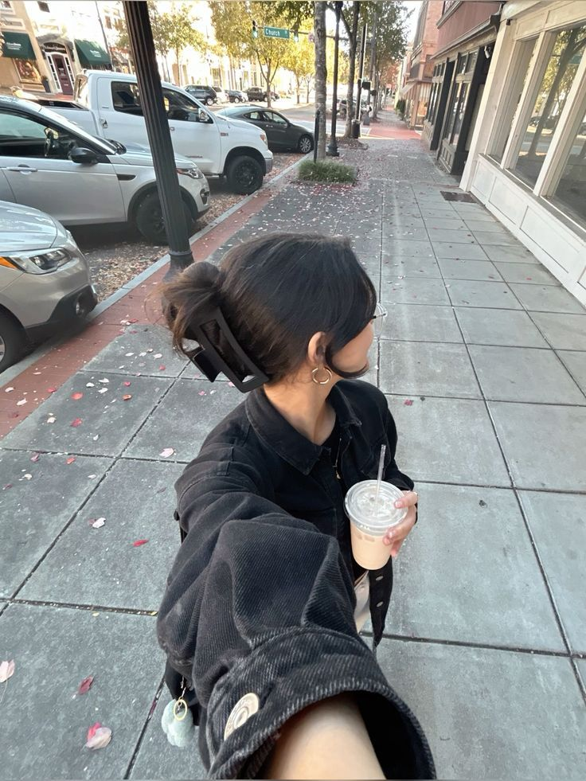

# 🖼️ AI Image Caption Recommendation System

This project uses CLIP model to recommend the most relevant captions for a given image from a large set of creative text prompts.

## 🔍 How it works
- Uses CLIP to extract image & text embeddings
- Computes cosine similarity between them
- Returns top N best-matching captions

## 📸 Sample Output

**Input Image:**



**Top Captions:**

The comfort of connection. (Similarity: 0.2417)
A sip of happiness. (Similarity: 0.2416)
Embrace the moment, one cup at a time. (Similarity: 0.2415)
A way to connect with yourself. (Similarity: 0.2390)
Fuel for your journey. (Similarity: 0.2365)

## 🚀 Try It Yourself

- 📒 [Colab Notebook (View Only)](https://colab.research.google.com/drive/1JrkDEn_2YSEBb4Mx2ukQAFIC9fUSPE2x?usp=sharing)
- 💻 [Source Code on GitHub](https://github.com/your-username/ai-image-caption-recommender)

## 🛠️ Requirements

- torch
- transformers
- scikit-learn
- Pillow

Install with:

```bash
pip install torch transformers scikit-learn Pillow